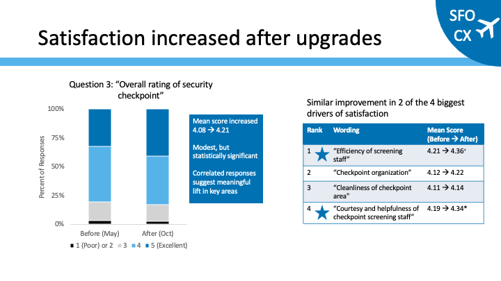
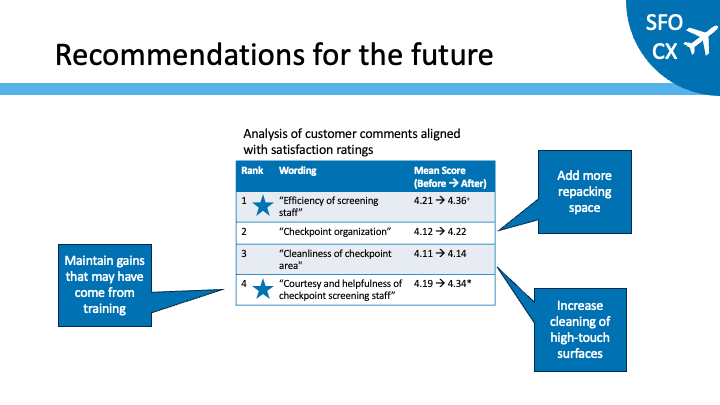

# SFO_CX_Survey
Code files to implement public portfolio project that analyzes customer survey responses about San Francisco International Airport (SFO) security screening. 

## Business Problem
The City and County of San Francisco comissioned a pair of studys to understand the impact of upgrades to airport screening at SFO in 2019.  These surveys were made publically available.  I selected this dataset for anlayiss because it allows me to answer these business questions:
 - Was there was a significant change in satsifaction?
 - Which portions of the experience most impact satisfaction?
 - What opportunities for further improvement remain?
				
## Key Findings
 - Overall satisfaction significantly incrased after upgrades
 - Of the four biggest drivers of satisfaction, two showed improvement
 - Recommendations for improvement between survey responses and freeform text aligned: more repacking space and increased cleaning of high-touch surfaces

## Data Sources
- SFO May Survey Responses (https://data.sfgov.org/Transportation/SFO-Screening-Checkpoint-Satisfaction-May-2019/jt6x-6hpy/about_data)
- SFO Oct Survey Responses (https://data.sfgov.org/Transportation/SFO-Screening-Checkpoint-Satisfaction-October-2019/xyey-v962/about_data)

## Tech Stack
- Web-Based SAS Studio (https://welcome.oda.sas.com)
- Anaconda (https://www.anaconda.com/download)

## Features
- Import raw survey results into SAS ([01_SFO-CX_Import_Data.sas](SAS/01_SFO-CX_Import_Data.sas))
- Consistently format survey responses for downstream analysis ([02_SFO-CX_Data_Prep.sas](SAS/02_SFO-CX_Data_Prep.sas))
- Define and use of custom SAS macro to evaluate changes between pre- and post- samples, collinearity between Likert questions, and contribution of Likert questions to overall satisfaction ([03_SFO-CX_Variable_Scan.sas](SAS/03_SFO-CX_Variable_Scan.sas))
- Implement finalized statistical tests of changes between the two survey timepoints; Prepare summary information for presentation ([04_SFO-CX_Statistical_Tests.sas](SAS/04_SFO-CX_Statistical_Tests.sas))
- Implement LLM in Python to identify topics in freeform text.  Evaluate of frequency of topics in pre- and post- sample to look for impacts of security screening updates. ([05_SFO-CX_LLM_Implementation.py](SAS/05_SFO-CX_LLM_Implementation.py))

## Contact
Beau Brouillette - [LinkedIn](https://www.linkedin.com/in/beau-brouillette) - brouillette.beau@gmail.com
